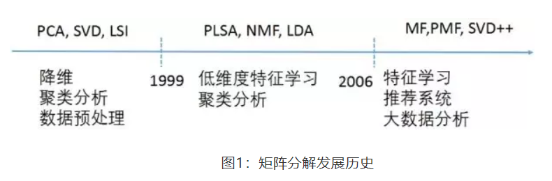
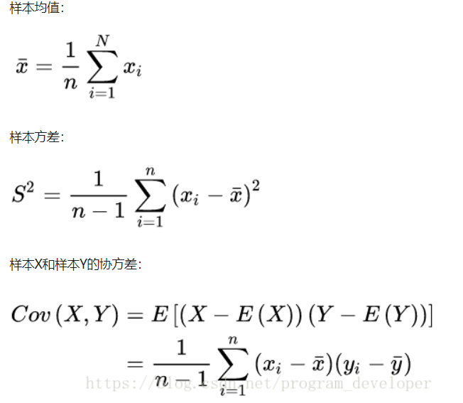
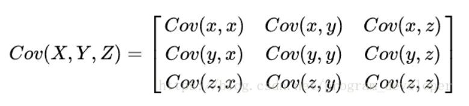

## 参考链接  
https://blog.csdn.net/program_developer/article/details/80632779  
https://www.cnblogs.com/gczr/p/10348446.html  
https://www.cnblogs.com/xinyuyang/p/11178676.html
## 1、PCA（一种降维方法）  
降维就是一种对高维度特征数据预处理方法。降维是将高维度的数据保留下最重要的一些特征，去除噪声和不重要的特征，从而实现提升数据处理速度的目的。在实际的生产和应用中，降维在一定的信息损失范围内，可以为我们节省大量的时间和成本。降维也成为应用非常广泛的数据预处理方法。

降维具有如下一些优点：  
1) 使得数据集更易使用。
2) 降低算法的计算开销。
3) 去除噪声。
4) 使得结果容易理解。
降维的算法有很多，比如奇异值分解(SVD)、主成分分析(PCA)、因子分析(FA)、独立成分分析(ICA)。

## 2、几个重要参数

> 有时间把上面的换成手打的  

由上面的公式，我们可以得到以下结论：
(1) 方差的计算公式是针对一维特征，即针对同一特征不同样本的取值来进行计算得到；而协方差则必须要求至少满足二维特征；方差是协方差的特殊情况。
(2) 方差和协方差的除数是n-1,这是为了得到方差和协方差的无偏估计。协方差为正时，说明X和Y是正相关关系；协方差为负时，说明X和Y是负相关关系；协方差为0时，说明X和Y是相互独立。Cov(X,X)就是X的方差。当样本是n维数据时，它们的协方差实际上是协方差矩阵(对称方阵)。例如，对于3维数据(x,y,z)，计算它的协方差就是:

## 3、算法流程
基于SVD分解协方差矩阵实现PCA算法
输入数据集$x^{(i)}=(x_1,x_2,x_3,\dots,x_n)$需要降到k维。大致流程如下
1) 去平均值，即每一位特征减去各自的平均值。
2) 计算协方差矩阵。
3) 通过SVD计算协方差矩阵的特征值与特征向量。
4) 对特征值从大到小排序，选择其中最大的k个。然后将其对应的k个特征向量分别作为列向量组成特征向量矩阵。
5) 将数据转换到k个特征向量构建的新空间中。


## 4、MATLAB函数
数据集X(每行为一个样本,行数为样本数)
```matlab
coeff = pca(X)
coeff = pca(X,Name,Value)
[coeff,score,latent] = pca(___)
[coeff,score,latent,tsquared] = pca(___)
[coeff,score,latent,tsquared,explained,mu] = pca(___)
```

X :--数据集 假设n个样本, 每个样本p维,则 X是n-by-p的matrix
__参考：__
https://blog.csdn.net/qq_25800311/article/details/83385029